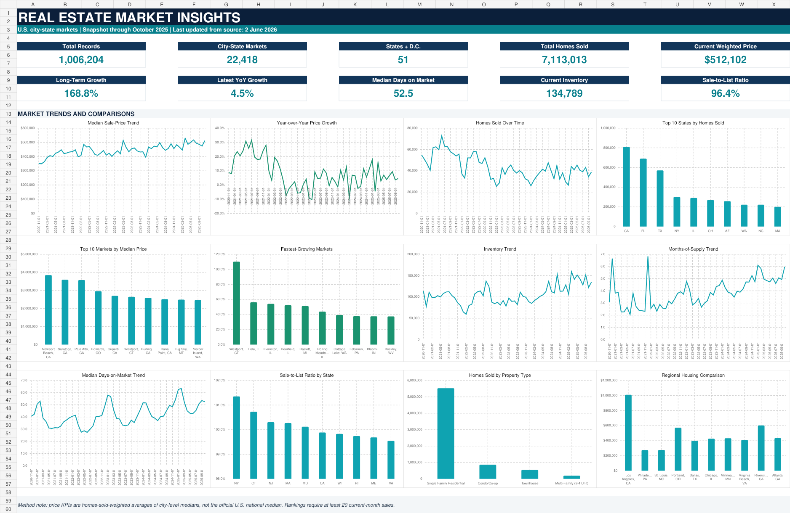

# Real Estate Price Trend Analysis & Market Insights

## Project overview

This project examines monthly U.S. city-level housing-market data with SQLite and Microsoft Excel. The complete source contains 1,048,575 rows through May 2026. To stay consistent with the original September–October 2025 project period, the published analysis uses only records available through 31 October 2025.



## Business problem

Housing data can be misleading when city names repeat across states, city coverage changes over time, or All Residential totals are added to overlapping property subtypes. The goal was to create a repeatable analysis that measures price direction, sales activity, inventory and market competitiveness without inflating totals or presenting a city-weighted price as an official national median.

## Objectives

- Validate the original resume claims against the complete file.
- Build a reproducible SQLite cleaning and analysis workflow.
- Compare price, sales, inventory, supply and competition across time and locations.
- Create a professional Excel dashboard from compact verified outputs.
- Document every KPI, cutoff, weighting rule and limitation.

## Dataset

- 1,048,575 raw rows and 58 columns.
- Monthly data from January 2012 through May 2026.
- 1,006,204 rows through the project cutoff.
- 15,860 unique city names in the full file.
- 22,418 unique city-state markets through the cutoff.
- All 50 states plus Washington, D.C.
- Five property categories: All Residential, Single Family Residential, Condo/Co-op, Townhouse and Multi-Family (2–4 Unit).

The row grain is one monthly market (`TABLE_ID`), property type and seasonal-adjustment status. The stable analytical key is `TABLE_ID + PERIOD_BEGIN + PROPERTY_TYPE + IS_SEASONALLY_ADJUSTED`.

The CSV is not included because it is about 425 MB. See [data/README.md](data/README.md) for placement instructions.

## Tools used

- SQLite for ingestion, cleaning, quality checks, reusable views and analysis.
- Microsoft Excel for the KPI dashboard, analysis tables, conditional formatting and charts.
- Power Query, PivotTables and the Excel Data Model are the recommended refresh path for the full local dataset.
- VS Code for running and reviewing the project files.

## Data cleaning and safeguards

- Loaded all raw values as text before conversion.
- Converted `DD-MM-YYYY` source dates to ISO dates.
- Converted numeric fields with blanks retained as `NULL`.
- Checked exact rows and the stable analytical key for duplicates; neither had duplicates.
- Flagged prices outside $10,000–$5,000,000 and sale-to-list ratios outside 0.50–1.50 instead of deleting them.
- Required at least 20 current-month sales for city rankings.
- Used All Residential for total homes sold, inventory and other additive KPIs.
- Used a common-market panel for the long-term endpoint comparison.
- Excluded records after October 2025 from the published dashboard.

## SQL techniques

The SQL files use `WHERE`, `GROUP BY`, `HAVING`, `CASE WHEN`, CTEs, joins, subqueries, date functions, aggregates, `LAG`, `RANK`, `DENSE_RANK`, rolling windows and 3-/12-month moving averages.

## KPI definitions

| KPI | Definition |
|---|---|
| Total Records | Rows with `PERIOD_END <= '2025-10-31'` |
| City-State Markets | Distinct `REGION` through the cutoff |
| Total Homes Sold | Sum of `HOMES_SOLD` for All Residential only |
| Current Weighted Price | `SUM(city median price × homes sold) / SUM(homes sold)` for Oct 2025 |
| Long-Term Growth | Common-market weighted price in Oct 2025 divided by Jan 2012, minus 1 |
| Latest YoY Growth | Oct 2025 weighted price divided by Oct 2024, minus 1 |
| Median DOM | Homes-sold-weighted city median DOM |
| Months of Supply | Inventory-weighted city months of supply |
| Sale-to-List | Homes-sold-weighted valid city ratio |

The weighted price is an analytical combination of city-level medians. It is not the official U.S. national median sale price.

## Verified results

| Measure | Result |
|---|---:|
| Analysis records | 1,006,204 |
| City-state markets | 22,418 |
| State jurisdictions | 51 |
| All Residential homes sold | 7,113,013 |
| October 2025 weighted price | $512,102 |
| October 2025 YoY growth | 4.51% |
| Common-market long-term growth | 168.83% |
| October 2025 inventory | 134,789 |
| Weighted median DOM | 52.52 days |
| Weighted sale-to-list ratio | 96.42% |

The original 7.36M claim is correct only when the full file through May 2026 is included. The original 2.16% YoY figure could not be reproduced. Full validation is in [documentation/data_profile.md](documentation/data_profile.md).

## Dashboard features

The Excel workbook contains the requested Dashboard, KPI Summary, State Analysis, City Analysis, Property Type Analysis, Monthly Trends, Pivot Analysis, Data Dictionary and Instructions sheets. The dashboard places 10 KPI cards and 12 charts on one canvas using a navy, teal, white and light-grey theme.

Because the CSV and database paths are local to each computer, native Data Model connections and slicers cannot be shipped with a universal path. The workbook includes verified chart-source tables and exact steps for connecting the `vw_dashboard_*` SQLite views in Excel Desktop, then adding State, Region, Property Type, Year, Month and seasonal-status slicers plus a period timeline.

## Key insights

- The common-market weighted price measure increased 168.83% from January 2012 to October 2025.
- October 2025 price growth was 4.51% YoY while sales were down 13.44%.
- California, Florida and Texas accounted for 29.10% of project-period sales.
- Inventory fell 11.71% YoY, but months of supply rose 26.40% to 5.97 months.
- Weighted DOM increased 6.15% to 52.52 days.
- Newport Beach, CA had the highest eligible October median at $3.849M; Johnstown, PA had the lowest at $58,500.

See [documentation/insights.md](documentation/insights.md) for all 13 verified insights.

## Project structure

```text
real-estate-market-insights/
├── data/
│   └── README.md
├── sql/
│   ├── create_database.sql
│   ├── data_cleaning.sql
│   ├── analysis_queries.sql
│   └── dashboard_views.sql
├── excel_dashboard/
│   └── Real_Estate_Market_Insights_Dashboard.xlsx
├── images/
│   └── dashboard_preview.png
├── documentation/
│   ├── data_dictionary.md
│   ├── data_profile.md
│   ├── insights.md
│   └── portfolio_content.md
├── README.md
└── .gitignore
```

## Complete Windows and VS Code setup

### 1. Install VS Code

Download the Windows User Installer from <https://code.visualstudio.com/download>, run it, and keep **Add to PATH** enabled. The official Windows guide recommends User Setup for most people: <https://code.visualstudio.com/docs/setup/windows>.

### 2. Install SQLite

1. Open <https://sqlite.org/download.html>.
2. Under **Precompiled Binaries for Windows**, download the current `sqlite-tools-win-x64-....zip` file.
3. Extract it to `C:\sqlite`.
4. Search Windows for **Environment Variables**.
5. Open **Edit the system environment variables > Environment Variables**.
6. Under User variables, edit `Path` and add `C:\sqlite`.
7. Restart VS Code.
8. Open **Terminal > New Terminal** and verify:

```powershell
sqlite3 --version
```

The SQLite command-line shell documentation is at <https://sqlite.org/cli.html>.

### 3. Install the VS Code SQLite extension

1. In VS Code, press `Ctrl+Shift+X`.
2. Search for `SQLite` by `alexcvzz`.
3. Install it. Marketplace page: <https://marketplace.visualstudio.com/items?itemName=alexcvzz.vscode-sqlite>.

### 4. Open the project and place the CSV

Assuming the project is on your Desktop, open PowerShell and run:

```powershell
cd "$env:USERPROFILE\Desktop\real-estate-market-insights"
code .
```

Copy `City_tracker(2).csv` into the `data` folder.

### 5. Create the database

Run this in the VS Code terminal from the project root:

```powershell
sqlite3 real_estate.db ".read sql/create_database.sql"
sqlite3 real_estate.db
```

At the `sqlite>` prompt, run:

```text
.mode csv
.import --skip 1 "data/City_tracker(2).csv" real_estate_raw
SELECT COUNT(*) FROM real_estate_raw;
```

The expected count is `1048575`. Importing 425 MB can take several minutes. Do not close the terminal.

### 6. Run the SQL files in order

Still at the `sqlite>` prompt:

```text
.read sql/data_cleaning.sql
.read sql/dashboard_views.sql
.read sql/analysis_queries.sql
.quit
```

`data_cleaning.sql` materializes and indexes the cleaned table, so its first run is the slowest.

### 7. View query results in VS Code

1. Press `Ctrl+Shift+P`.
2. Run **SQLite: Open Database** and choose `real_estate.db`.
3. Open `sql/analysis_queries.sql`.
4. Select one query at a time.
5. Press `Ctrl+Shift+Q`, or right-click and choose **Run Query**.
6. Results appear in a table inside VS Code.

## Excel dashboard usage and refresh

1. Open `excel_dashboard/Real_Estate_Market_Insights_Dashboard.xlsx` in Microsoft Excel Desktop.
2. Review the Dashboard sheet first; the included workbook is a verified October 2025 snapshot.
3. For a local refresh, choose **Data > Get Data > From Database > From SQLite Database**.
4. Select `real_estate.db` and load the `vw_dashboard_*` views.
5. Choose **Only Create Connection** and **Add this data to the Data Model**.
6. Create PivotTables from the Data Model.
7. Add slicers from **PivotTable Analyze > Insert Slicer** and a date timeline from **Insert Timeline**.
8. Use **Data > Refresh All** after the local connections are saved.

### Capture a dashboard screenshot

1. Open the Dashboard sheet and set zoom so cells `A1:X60` are visible.
2. Hide the formula bar and ribbon with `Ctrl+F1` if more space is needed.
3. Press `Windows+Shift+S`.
4. Select the complete dashboard and save it as `images/dashboard_preview.png`.

## Upload to GitHub

Create an empty GitHub repository named `real-estate-market-insights`. Then run these commands from the project root in VS Code:

```powershell
git init
git add .
git commit -m "Add real estate market insights project"
git branch -M main
git remote add origin https://github.com/YOUR-USERNAME/real-estate-market-insights.git
git push -u origin main
```

Before `git add .`, confirm that `data/City_tracker(2).csv` is greyed out in VS Code. You can also check:

```powershell
git status
```

The CSV and `real_estate.db` must not appear under files to be committed.

## Limitations

- The source is city-level aggregate data rather than transaction-level data.
- Weighted city medians are not equivalent to a transaction-level national median.
- Market coverage changes over time; the long-term comparison therefore uses a smaller common-market panel.
- October 2025 rankings can still be volatile after the 20-sale threshold.
- The source is not seasonally adjusted.
- The complete file includes partial later data relative to the project cutoff.
- Some metrics have substantial null coverage, especially price drops and period-over-period fields.

## Future improvements

- Add Census region and population data for demographic normalization.
- Compare price trends with mortgage-rate and income data.
- Build a transaction-volume-weighted affordability index.
- Automate the Power Query refresh with a stable local parameter for the database path.
- Add a Streamlit or Power BI version for easier web sharing.

## Portfolio material

Corrected resume bullets, LinkedIn copy, interview questions, a one-minute explanation and calculation details are available in [documentation/portfolio_content.md](documentation/portfolio_content.md).

